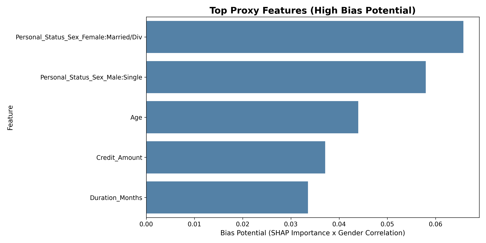

# Detailed Model Explainability Report (Human Readable)

## 1. Summary
- Approval rate: **0.6500**
- Male approval: **0.6855**
- Female approval: **0.5710**

## 2. Global Importance
| rank | feature | mean_abs_shap | mean_shap |
| --- | --- | --- | --- |
| 1 | Checking_Status_No account | 0.797988 | 0.078794 |
| 2 | Duration_Months | 0.411801 | -0.080592 |
| 3 | Credit_Amount | 0.397047 | -0.028925 |
| 4 | Credit_History_Critical account | 0.324546 | 0.003645 |
| 5 | Purpose_Used car | 0.301882 | 0.037559 |
| 6 | Purpose_Radio/TV | 0.279239 | -0.005928 |
| 7 | Age | 0.271913 | -0.011622 |
| 8 | Savings_No savings | 0.231115 | 0.028910 |
| 9 | Other_Plans_No account3 | 0.189258 | -0.039665 |
| 10 | Residence_Duration | 0.163373 | 0.012968 |

## 3. Top Positive Influencers
| rank | feature | mean_abs_shap | mean_shap |
| --- | --- | --- | --- |
| 1 | Checking_Status_No account | 0.797988 | 0.078794 |
| 5 | Purpose_Used car | 0.301882 | 0.037559 |
| 8 | Savings_No savings | 0.231115 | 0.028910 |
| 18 | Guarantors_Guarantor | 0.084716 | 0.019298 |
| 12 | Housing_Own | 0.145859 | 0.013128 |
| 10 | Residence_Duration | 0.163373 | 0.012968 |
| 14 | Telephone_Yes | 0.129786 | 0.009574 |
| 15 | Property_0-200 DM4 | 0.094239 | 0.004491 |
| 42 | Credit_History_Past delay | 0.013297 | 0.004114 |
| 4 | Credit_History_Critical account | 0.324546 | 0.003645 |

## 4. Top Negative Influencers
| rank | feature | mean_abs_shap | mean_shap |
| --- | --- | --- | --- |
| 2 | Duration_Months | 0.411801 | -0.080592 |
| 9 | Other_Plans_No account3 | 0.189258 | -0.039665 |
| 3 | Credit_Amount | 0.397047 | -0.028925 |
| 22 | Foreign_Worker_No | 0.068931 | -0.022538 |
| 11 | Employment_Duration_4-7yrs | 0.150002 | -0.022211 |
| 23 | Personal_Status_Sex_Female:Married/Div | 0.065788 | -0.015140 |
| 24 | Savings_100-500 DM | 0.062841 | -0.012674 |
| 40 | Guarantors_Co-applicant | 0.017318 | -0.012233 |
| 16 | Savings_> 1000 DM | 0.086529 | -0.011679 |
| 7 | Age | 0.271913 | -0.011622 |

## 5. Local Representative Cases
### Case: Approved (Index 406)
- Probability: **0.9980**
- Gender: **Male**

| feature | feature_value | shap_value | direction |
| --- | --- | --- | --- |
| Purpose_Used car | 1.000000 | 1.526283 | push_up |
| Checking_Status_No account | 1.000000 | 1.234714 | push_up |
| Savings_No savings | 1.000000 | 0.627344 | push_up |
| Credit_History_Critical account | 1.000000 | 0.511111 | push_up |
| Employment_Duration_4-7yrs | 1.000000 | 0.385614 | push_up |
| Age | 43.000000 | 0.323314 | push_up |
| Telephone_Yes | 1.000000 | 0.292000 | push_up |
| Credit_Amount | 2197.000000 | 0.235790 | push_up |
| Other_Plans_No account3 | 1.000000 | 0.183971 | push_up |
| Housing_Own | 1.000000 | 0.145585 | push_up |

### Case: Rejected (Index 973)
- Probability: **0.0150**
- Gender: **Male**

| feature | feature_value | shap_value | direction |
| --- | --- | --- | --- |
| Duration_Months | 60.000000 | -1.241805 | push_down |
| Checking_Status_No account | 0.000000 | -0.709634 | push_down |
| Credit_Amount | 7297.000000 | -0.654891 | push_down |
| Guarantors_Co-applicant | 1.000000 | -0.363150 | push_down |
| Property_0-200 DM4 | 1.000000 | -0.355150 | push_down |
| Housing_Own | 0.000000 | -0.256786 | push_down |
| Credit_History_Critical account | 0.000000 | -0.241530 | push_down |
| Installment_Rate | 4.000000 | -0.240323 | push_down |
| Purpose_Radio/TV | 0.000000 | -0.195281 | push_down |
| Savings_No savings | 0.000000 | -0.185297 | push_down |

### Case: Borderline (Index 975)
- Probability: **0.4998**
- Gender: **Female**

| feature | feature_value | shap_value | direction |
| --- | --- | --- | --- |
| Checking_Status_No account | 0.000000 | -0.774028 | push_down |
| Checking_Status_> 200 DM | 1.000000 | 0.687010 | push_up |
| Credit_Amount | 1258.000000 | -0.477901 | push_down |
| Duration_Months | 24.000000 | -0.477029 | push_down |
| Purpose_Radio/TV | 1.000000 | 0.474497 | push_up |
| Age | 57.000000 | 0.354768 | push_up |
| Credit_History_Critical account | 0.000000 | -0.271296 | push_down |
| Telephone_Yes | 0.000000 | -0.178871 | push_down |
| Purpose_Used car | 0.000000 | -0.145180 | push_down |
| Credit_History_Paid till now | 1.000000 | 0.108756 | push_up |

## 6. Fairness Audit Results
- **Disparate Impact Ratio (DIR)**: **0.8329**
  - ✅ **Pass**: DIR is above 0.8. The model's bias is within common legal thresholds.
- **Approval Rate Gap**: **11.45%**

### Proxy Feature Analysis
Features with high correlation to Gender may act as proxies:

| rank | feature | gender_corr |
| --- | --- | --- |
| 23 | Personal_Status_Sex_Female:Married/Div | 1.000000 |
| 20 | Personal_Status_Sex_Male:Single | 0.738036 |
| 30 | Personal_Status_Sex_Male:Married | 0.213357 |
| 35 | Dependents | 0.203431 |
| 19 | Employment_Duration_< 1yr | 0.187239 |
| 7 | Age | 0.161694 |
| 37 | Employment_Duration_> 7yrs | 0.156321 |
| 12 | Housing_Own | 0.119638 |
| 36 | Housing_Free | 0.100872 |
| 25 | Purpose_Furniture | 0.100467 |

## 7. Nhận xét nguồn gốc Bias (Bias Source Analysis)
### 7.1. Model có bias không? (Is the model biased?)
- **Trả lời**: **Không đáng kể**. Chỉ số DIR (**0.8329**) đạt trên ngưỡng 0.8. Tuy nhiên vẫn tồn tại khoảng cách phê duyệt 11.5%.

### 7.2. Gender có ảnh hưởng mạnh không? (Is Gender highly influential?)
- **Trả lời**: **Ảnh hưởng trực tiếp thấp**. Biến Gender không nằm trong nhóm yếu tố quyết định hàng đầu, bias có thể đến từ các biến gián tiếp.

### 7.3. Bias đến từ đâu? (Where does bias come from?)
Bias đến từ sự kết hợp giữa ảnh hưởng của biến Gender và các **Proxy Features** (biến đại diện).

#### Top Proxy Features Drivers:
| rank | feature | mean_abs_shap | gender_corr | bias_potential |
| --- | --- | --- | --- | --- |
| 23 | Personal_Status_Sex_Female:Married/Div | 0.065788 | 1.000000 | 0.065788 |
| 20 | Personal_Status_Sex_Male:Single | 0.078526 | 0.738036 | 0.057955 |
| 7 | Age | 0.271913 | 0.161694 | 0.043967 |
| 3 | Credit_Amount | 0.397047 | 0.093482 | 0.037117 |
| 2 | Duration_Months | 0.411801 | 0.081432 | 0.033534 |
| 1 | Checking_Status_No account | 0.797988 | 0.027169 | 0.021681 |
| 4 | Credit_History_Critical account | 0.324546 | 0.056200 | 0.018239 |
| 12 | Housing_Own | 0.145859 | 0.119638 | 0.017450 |
| 5 | Purpose_Used car | 0.301882 | 0.056410 | 0.017029 |
| 19 | Employment_Duration_< 1yr | 0.079146 | 0.187239 | 0.014819 |

- **Phân tích**: Bias đến từ cả biến Gender trực tiếp và các yếu tố liên quan.

## 8. Generated Files
- 01_shap_importance.csv
- 02_global_bar.png
- 03_global_beeswarm.png
- 04_decision_plot_sampled.png
- 05_waterfall_approved.png
- 05_waterfall_borderline.png
- 05_waterfall_rejected.png
- 06_local_contributors_approved.csv
- 06_local_contributors_borderline.csv
- 06_local_contributors_rejected.csv
- 07_gender_cohort_bar.png
- 08_dependence_1_Checking_Status_No_account.png
- 08_dependence_2_Duration_Months.png
- 08_dependence_3_Credit_Amount.png
- 09_summary_stats.csv
- 10_executive_summary.md
- 11_approval_rates.png
- 12_disparate_impact.png
- 13_bias_potential.png
- 14_gender_correlation.png