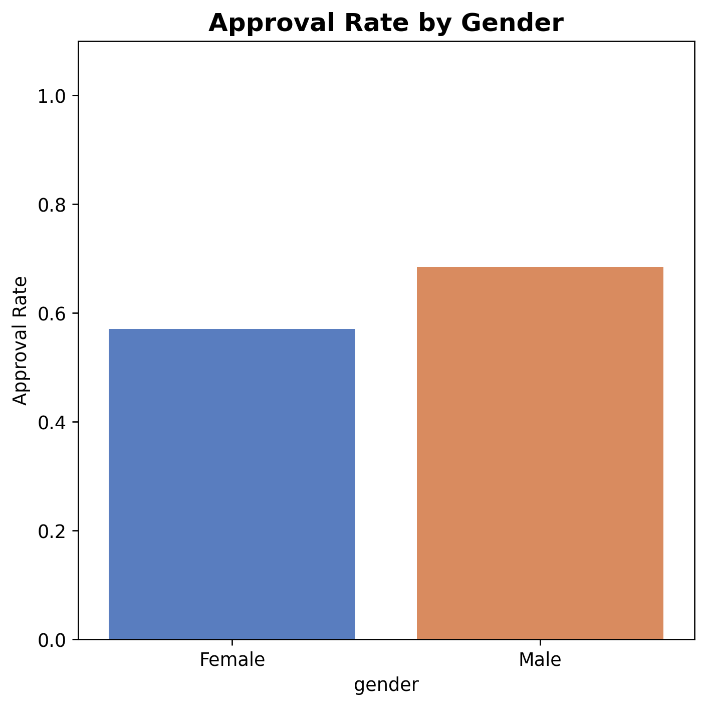
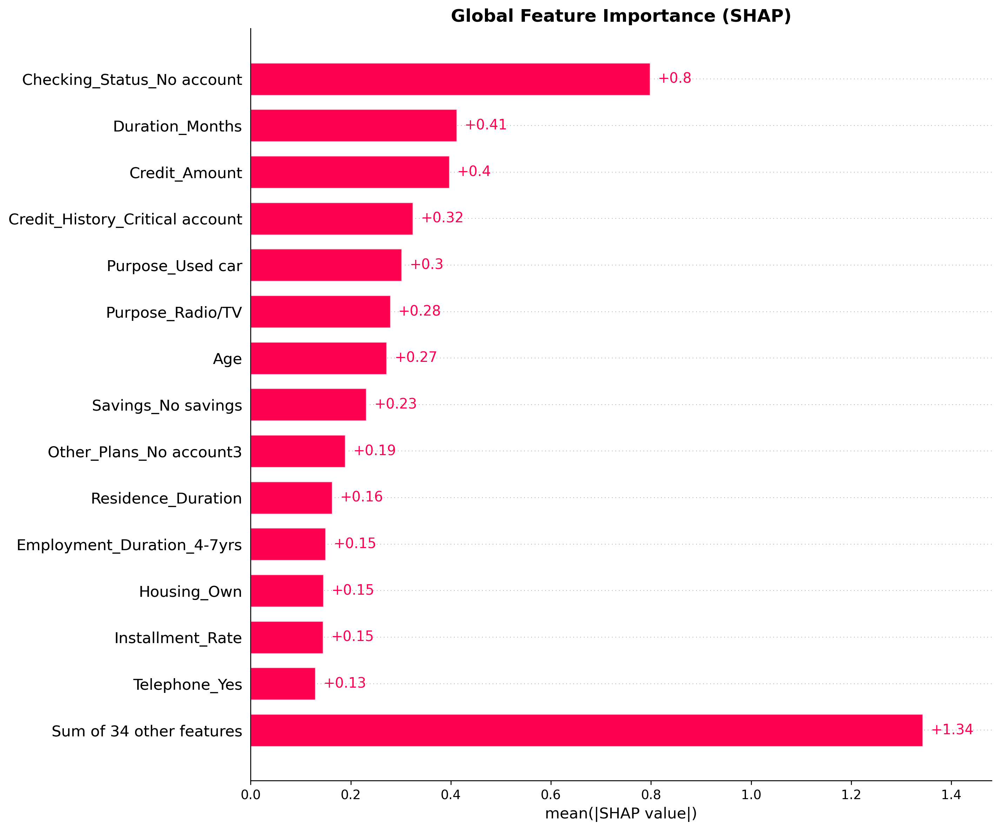
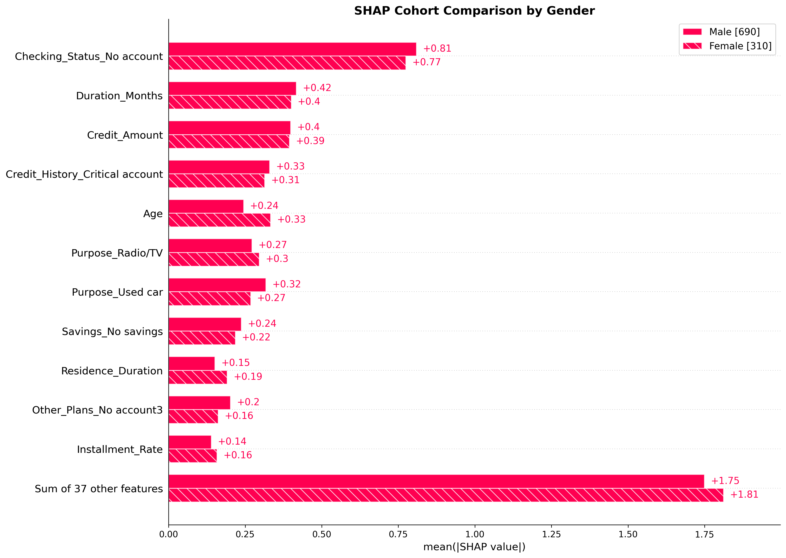

# 🔍 Phân Tích Dự Án: AI Có Công Bằng Không?
## Accuracy ≠ Fairness — Khi Model Chính Xác Nhưng Phân Biệt Gender

---

## 1. Tổng Quan Dự Án

Dự án **Trustworthy AI: Bias Audit trong Credit Scoring** sử dụng bộ dữ liệu **UCI German Credit Dataset** (1000 mẫu, 20 thuộc tính) để kiểm tra liệu mô hình **XGBoost** dự đoán tín dụng có công bằng giữa nam và nữ hay không.

Project gồm 3 thành phần chính:

| Thành phần | File | Mục đích |
|---|---|---|
| Fairness Audit | [script.py](Trustworthy_AI/script.py) | Tính Demographic Parity, Disparate Impact |
| SHAP Explainability | [model_explainability_readable.py](Trustworthy_AI/model_explainability_readable.py) | Giải thích mô hình bằng SHAP |
| Báo cáo | [remark.md](remark.md) | Tổng hợp nhận xét |

---

## 2. Kết Luận Chính: AI KHÔNG HOÀN TOÀN CÔNG BẰNG

> [!IMPORTANT]
> **Model XGBoost đạt accuracy tốt (65% approval rate tổng thể) nhưng có sự phân biệt đối xử rõ ràng theo giới tính.** Đây chính là minh chứng điển hình cho nguyên tắc **Accuracy ≠ Fairness**.

### 2.1. Bằng chứng số liệu

| Chỉ số | Giá trị | Ý nghĩa |
|---|---|---|
| **Approval Rate — Nam** | **68.55%** | Cứ 100 nam, ~69 người được duyệt |
| **Approval Rate — Nữ** | **57.10%** | Cứ 100 nữ, ~57 người được duyệt |
| **Khoảng cách** | **11.45%** | Nữ bị từ chối nhiều hơn đáng kể |
| **Demographic Parity (DP)** | **0.115** | > 0.1 → **Có bias** |
| **Disparate Impact Ratio (DIR)** | **0.833** | > 0.8 → Vượt qua "Four-fifths rule" nhưng sát ngưỡng |



### 2.2. Kết luận hai mặt

> [!WARNING]
> **Về mặt pháp lý**: DIR = 0.833 (> 0.8) → model "vượt qua" ngưỡng phân biệt đối xử theo quy tắc 80% của EEOC.
>
> **Về mặt thực tế**: Khoảng cách 11.45% là **đáng kể**. Với 1000 hồ sơ, điều này có nghĩa hàng chục phụ nữ bị từ chối tín dụng khi đáng lẽ có thể được duyệt nếu là nam.


---

## 3. Accuracy ≠ Fairness — Giải Thích Chi Tiết

### 3.1. Model "chính xác" nhưng "bất công" như thế nào?

Model XGBoost hoạt động tốt trong việc phân loại tín dụng tốt/xấu dựa trên các yếu tố tài chính. Tuy nhiên, **model đã học được các thiên kiến lịch sử (historical bias) từ dữ liệu training**:

```
                   ┌─────────────────┐
  Dữ liệu lịch sử │  Năm 1990s      │  → Phụ nữ ít được cho vay hơn
  (German Credit)  │  Xã hội Đức     │  → Thu nhập nữ thấp hơn nam
                   │  Thiên kiến      │  → Tài sản nữ ít hơn
                   └────────┬────────┘
                            │
                            ▼
                   ┌─────────────────┐
                   │  Model XGBoost  │  → Học được rằng "nữ = rủi ro cao hơn"
                   │  (Accurate!)    │  → Nhưng đây là BIAS, không phải sự thật
                   └────────┬────────┘
                            │
                            ▼
                   ┌─────────────────┐
                   │  Kết quả        │  → Nam: 68.55% approval
                   │  UNFAIR         │  → Nữ: 57.10% approval
                   └─────────────────┘
```

### 3.2. Top 10 Features Quan Trọng Nhất (theo SHAP)

Phân tích SHAP cho thấy model dựa chủ yếu vào **các yếu tố tài chính**, nhưng Gender vẫn có ảnh hưởng:

| Rank | Feature | mean SHAP | % Importance |
|---|---|---|---|
| 1 | Checking_Status (Tài khoản) | 0.798 | 15.11% |
| 2 | Duration_Months (Thời hạn vay) | 0.412 | 7.80% |
| 3 | Credit_Amount (Số tiền vay) | 0.397 | 7.52% |
| 4 | Credit_History (Lịch sử tín dụng) | 0.325 | 6.14% |
| 5 | Purpose (Mục đích vay) | 0.302 | 5.72% |
| 6 | Purpose_Radio/TV | 0.279 | 5.29% |
| **7** | **Age (Tuổi)** ⚠️ | **0.272** | **5.15%** |
| 8 | Savings (Tiết kiệm) | 0.231 | 4.38% |
| 9 | Other_Plans | 0.189 | 3.58% |
| 10 | Residence_Duration | 0.163 | 3.09% |

> [!NOTE]
> **Gender (Personal_Status_Sex) không nằm trong Top 10** — rank 20 (Male:Single, 1.49%) và rank 23 (Female:Married/Div, 1.25%). Nhưng bias vẫn xảy ra thông qua **proxy features**.



---

## 4. Nguồn Gốc Bias: Direct vs Proxy

> [!CAUTION]
> **Bias không chỉ đến từ biến Gender trực tiếp.** Model có thể "phân biệt" mà không cần nhìn trực tiếp vào giới tính, thông qua các **proxy features** — các biến có tương quan cao với giới tính.

### 4.1. Direct Bias — Ảnh hưởng trực tiếp của Gender

| Feature | SHAP value | % Importance | Mô tả |
|---|---|---|---|
| `Personal_Status_Sex_Male:Single` | 0.079 | 1.49% | Nam độc thân → push up |
| `Personal_Status_Sex_Female:Married/Div` | 0.066 | 1.25% | Nữ đã kết hôn/ly hôn → push **down** |
| `Personal_Status_Sex_Male:Married` | 0.039 | 0.75% | Nam đã kết hôn → ảnh hưởng nhẹ |

**Nhận xét**: Gender chiếm ~3.5% tổng importance — không quá lớn, nhưng đủ để tạo ra khoảng cách 11.45%.

### 4.2. Proxy Bias — Ảnh hưởng gián tiếp qua các biến đại diện

Các biến sau có **tương quan cao với giới tính** VÀ **ảnh hưởng mạnh đến model**:

| Feature | Tương quan với Gender | SHAP Importance | Bias Potential |
|---|---|---|---|
| `Personal_Status_Sex_Female` | **1.000** | 0.066 | 0.066 |
| `Personal_Status_Sex_Male:Single` | **0.738** | 0.079 | 0.058 |
| **Age (Tuổi)** ⚠️ | **0.162** | **0.272** | **0.044** |
| Credit_Amount | 0.093 | 0.397 | 0.037 |
| Duration_Months | 0.081 | 0.412 | 0.034 |
| Housing_Own | 0.120 | 0.146 | 0.017 |
| Employment_Duration_<1yr | 0.187 | 0.079 | 0.015 |


### 4.3. Case Study — Bias Potential của "Age"

**Age (Tuổi)** là proxy nguy hiểm nhất:
- **Rank 7** trong top features quan trọng (5.15% importance)  
- Tương quan với giới tính: **0.162** (trong dataset, nữ có phân bố tuổi khác nam)
- **Bias potential = 0.044** — cao thứ 3 trong tất cả features

→ Điều này có nghĩa: kể cả khi bỏ biến Gender khỏi model, **Age vẫn sẽ truyền tải một phần thông tin về giới tính**, và model vẫn có thể phân biệt gián tiếp.

---

## 5. So Sánh SHAP Giữa Nam và Nữ



Biểu đồ cohort so sánh cho thấy:
- Các feature quan trọng nhất (Checking Status, Duration, Credit Amount) ảnh hưởng **tương tự** giữa hai nhóm
- Nhưng có sự khác biệt ở **Age, Employment Duration, Housing** — chính là các proxy features

---

## 6. Tóm Tắt: AI Có Công Bằng Không?

```
┌─────────────────────────────────────────────────────────────────┐
│                    KẾT LUẬN CUỐI CÙNG                          │
├─────────────────────────────────────────────────────────────────┤
│                                                                 │
│  ❌  AI KHÔNG HOÀN TOÀN CÔNG BẰNG                               │
│                                                                 │
│  📊 Accuracy cao ≠ Fairness                                     │
│     → Model chính xác trong phân loại tín dụng                  │
│     → Nhưng phân biệt giới tính với gap 11.45%                 │
│                                                                 │
│  ⚖️  Pháp lý: PASS (DIR = 0.833 > 0.8)                         │
│     → Vượt qua "Four-fifths rule"                               │
│     → Nhưng sát ngưỡng!                                        │
│                                                                 │
│  🔬 Đạo đức: FAIL                                               │
│     → DP = 0.115 > 0.1 → Có bias                               │
│     → Bias đến từ cả direct (3.5%) và proxy features           │
│     → Age, Employment, Housing "mô phỏng" giới tính            │
│                                                                 │
│  💡 Bài học: Không thể chỉ đánh giá AI bằng accuracy           │
│     → Cần audit fairness đa chiều                               │
│     → Cần kiểm tra cả proxy bias                               │
│     → Accuracy cao có thể che giấu discrimination              │
│                                                                 │
└─────────────────────────────────────────────────────────────────┘
```

---

## 7. Điểm Mạnh & Hạn Chế Của Dự Án

### ✅ Điểm mạnh
- Sử dụng **Fairlearn** — thư viện chuẩn công nghiệp cho fairness audit
- Có phân tích **SHAP** ở cả global và local level
- Phân tích **proxy features** — không chỉ dừng ở direct bias
- Mapping giới tính đã được sửa đúng (`A92`, `A95` = Female)
- Có biểu đồ trực quan phong phú (20 output files)

### ⚠️ Hạn chế
- **Không có train/test split** — audit trên toàn bộ dataset, không đánh giá generalization
- **Không có training pipeline** — model load từ pickle, không tái lập được
- Chỉ dùng **2 fairness metric** (DP và DIR) — thiếu Equal Opportunity, Equalized Odds
- Thiếu **confusion matrix theo nhóm** — không biết FPR/FNR theo giới tính
- Ngưỡng kết luận (DP > 0.1, DIR < 0.8) là **rule of thumb**, không phải tiêu chuẩn tuyệt đối

---

## 8. Khuyến Nghị

> [!TIP]
> Để biến project thành một fairness audit hoàn chỉnh, cần bổ sung:
> 1. **Training pipeline** rõ ràng với train/test split
> 2. **Thêm fairness metrics**: Equal Opportunity, Equalized Odds, Calibration by group
> 3. **Confusion matrix theo giới tính** để thấy bias ở FPR/FNR
> 4. **Mitigation**: thử `ExponentiatedGradient` hoặc `ThresholdOptimizer` từ Fairlearn để giảm bias
> 5. **Causal analysis**: kiểm tra quan hệ nhân quả thay vì chỉ tương quan
