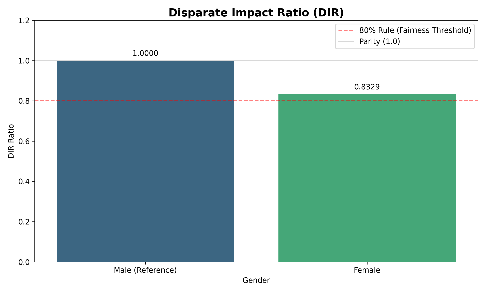
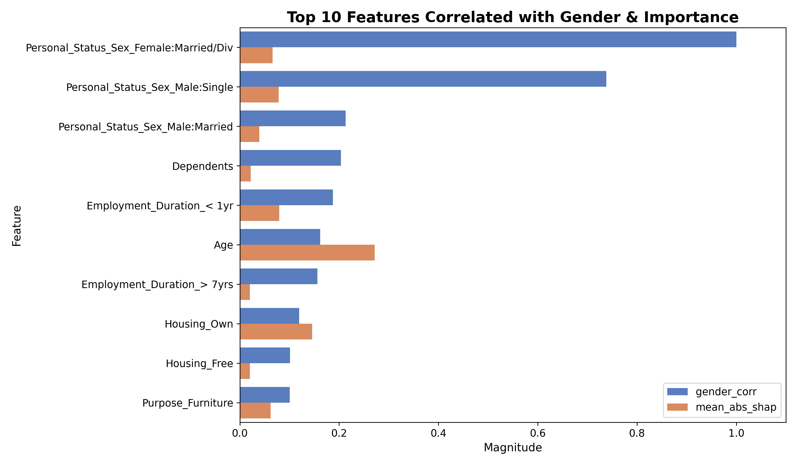

# Nhận xét về mô hình dự báo rủi ro tín dụng (German Credit)

### 1. Tổng quan về tính công bằng (Fairness Audit)
Mô hình hiện tại cho thấy sự chênh lệch trong quyết định phê duyệt dựa trên giới tính.

- **Khoảng cách Tỉ lệ phê duyệt (Approval Rate Gap):** **11.45%** (Nam giới có tỷ lệ được duyệt cao hơn).
- **Chỉ số Tác động Khác biệt (Disparate Impact Ratio - DIR):** **0.8329**.

**Đánh giá tuân thủ:**
- **Về mặt pháp lý/tuân thủ:** Với DIR = 0.8329 (> 0.8), mô hình vượt qua quy tắc "Four-fifths rule" của EEOC, nghĩa là không có sự phân biệt đối xử rõ rệt ở mức độ nghiêm trọng bị cấm.
- **Về mặt kỹ thuật:** Tuy nhiên, khoảng cách 11.45% vẫn là con số đáng kể, cho thấy mô hình "ưu ái" nam giới hơn trong bộ dữ liệu này.

### 2. Tầm quan trọng của các biến (Feature Importance)
Phân tích SHAP cho thấy các biến tài chính truyền thống vẫn giữ vai trò chủ đạo, nhưng các biến nhân khẩu học cũng đóng góp một phần.

- **Yếu tố quyết định hàng đầu:** Trạng thái tài khoản (`Checking_Status`), Thời hạn vay (`Duration_Months`) và Số tiền vay (`Credit_Amount`).
- **Vị trí của Giới tính:** Biến `Personal_Status_Sex` nằm ngoài Top 10 về tầm quan trọng tổng thể.

### 3. Nguồn gốc của Bias: Direct vs Proxy Features
Bias không chỉ đến từ việc mô hình biết giới tính khách hàng, mà còn thông qua các biến trung gian.

#### a. Direct Bias
Đặc trưng giới tính (`Personal_Status_Sex`) có ảnh hưởng nhất định tới kết quả dự báo dù không nằm trong nhóm yếu tố quyết định hàng đầu. Cụ thể, đặc trưng `Personal_Status_Sex Male:Married` (**Nam độc thân**) có giá trị SHAP khoảng 0.078, chiếm 1.49% mức độ quan trọng trong mô hình. Trong khi đó, `Personal_Status_Sex_Female:Married/Div` (**Nữ đã kết hôn/ly hôn**) đạt giá trị SHAP khoảng 0.065, chiếm 1.25% mức độ quan trọng trong mô hình.

#### b. Proxy Features
Các đặc điểm có tương quan cao với giới tính đang vô tình "mô phỏng" giới tính để đưa vào mô hình:
- **Tuổi tác (Age):** Có độ tương quan ~0.16 với giới tính và là biến quan trọng (Rank 7). Đây là một proxy mạnh.
- **Thời gian làm việc (Employment Duration):** Nhóm làm việc dưới 1 năm có tương quan cao với giới tính.
- **Sở hữu nhà (Housing_Own):** Tỷ lệ sở hữu nhà khác nhau giữa các nhóm giới tính trong dữ liệu lịch sử cũng gây ra bias gián tiếp.

